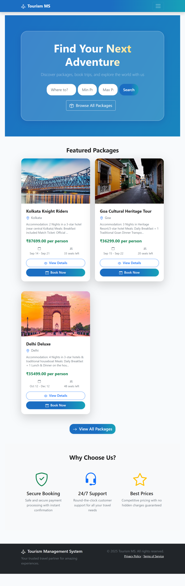
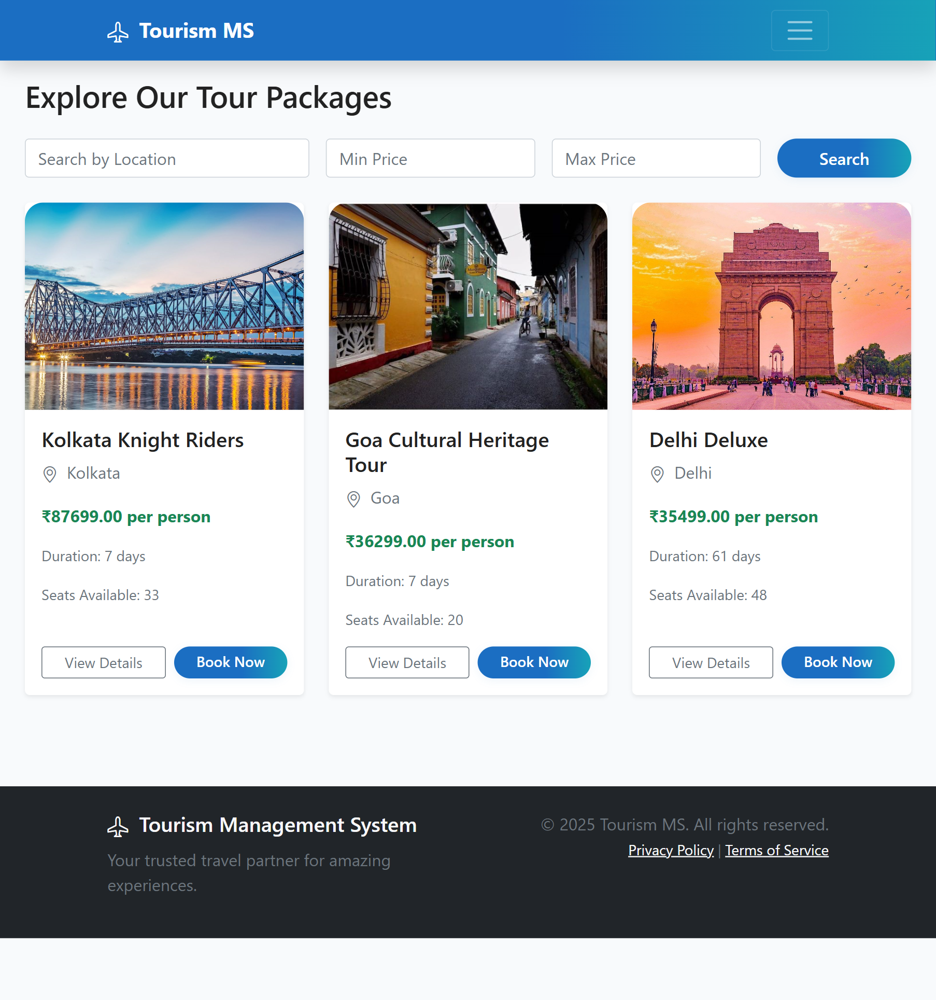
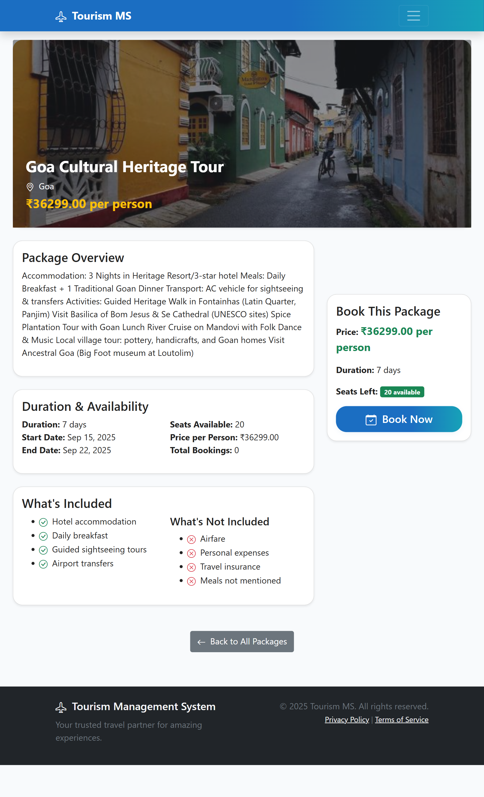
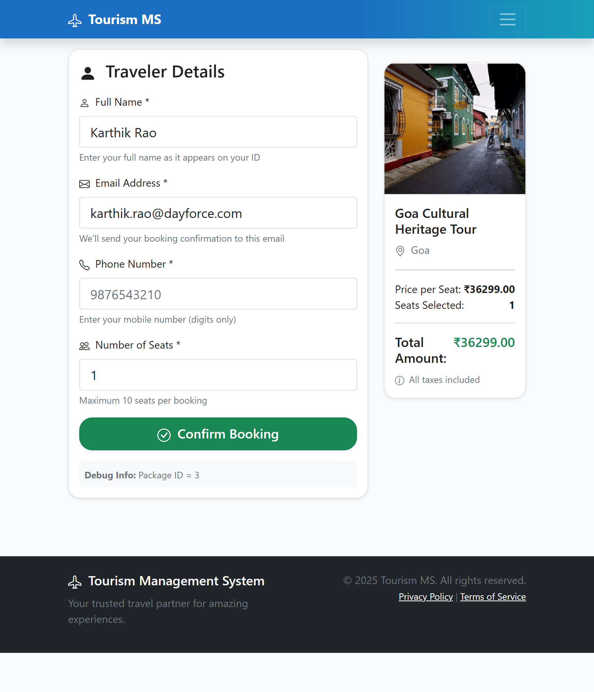
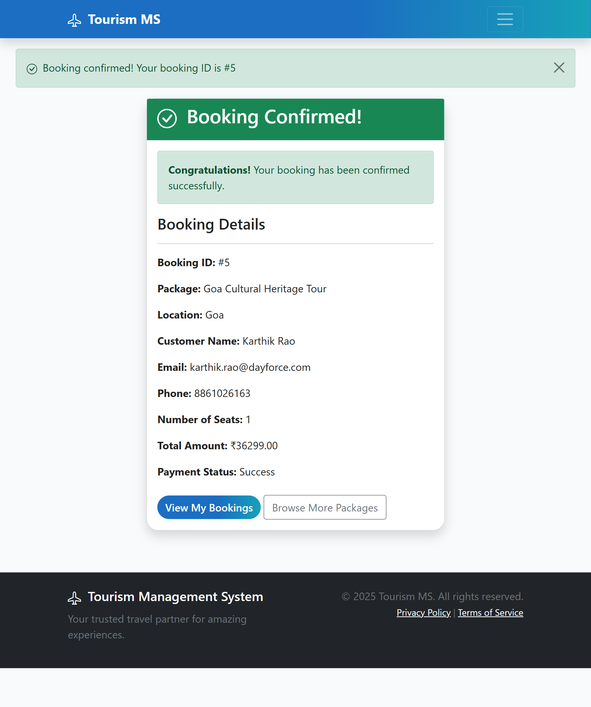
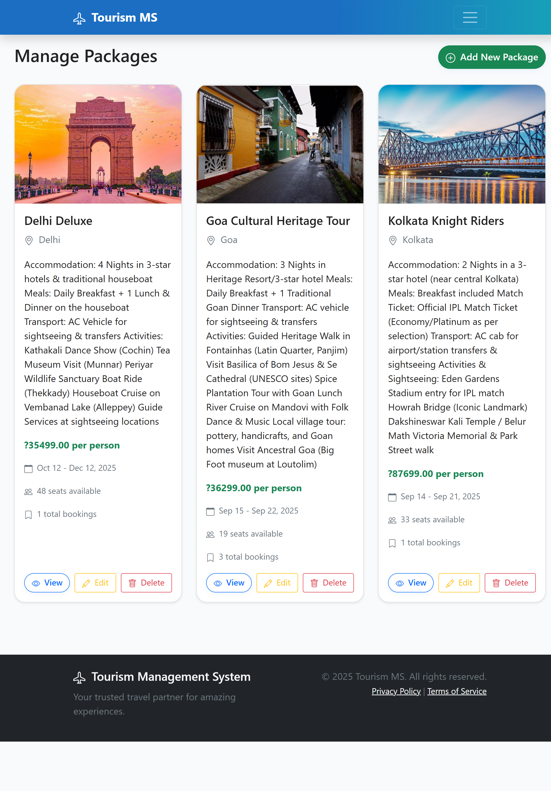
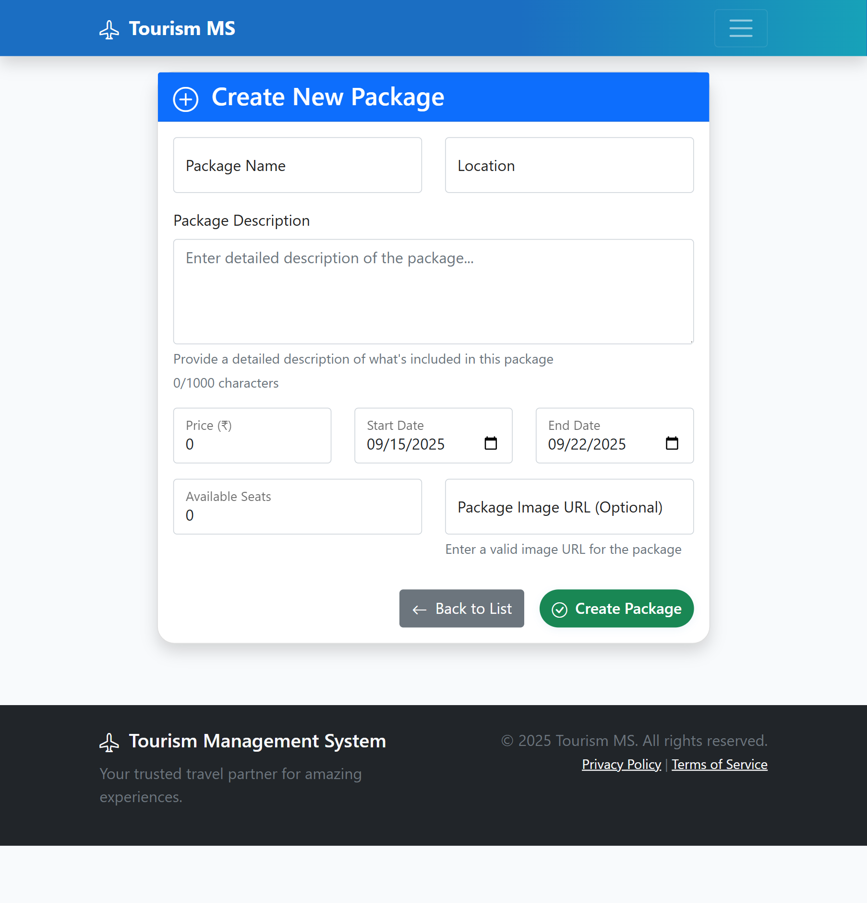
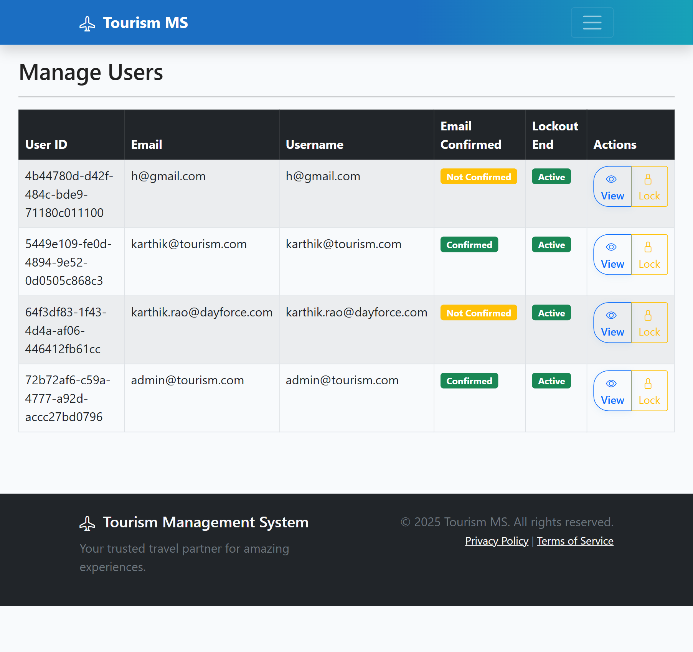

# Tourism Management System

A comprehensive web application built with ASP.NET Core 8.0 and Entity Framework Core for managing tourism packages, bookings, and customer relationships.

## Table of Contents

- [Features](#features)
- [Screenshots](#screenshots)
- [Technology Stack](#technology-stack)
- [Getting Started](#getting-started)
- [Installation](#installation)
- [Database Setup](#database-setup)
- [Usage](#usage)
- [Project Structure](#project-structure)
- [Configuration](#configuration)
- [Security Features](#security-features)
- [Contributing](#contributing)
- [License](#license)

## Features

### User Management
- User Registration and Authentication with ASP.NET Core Identity
- Role-based Access Control (Admin/Customer roles)
- Secure Login/Logout functionality

### Package Management
- CRUD Operations for tourism packages
- Package Search and Filtering by location, price, and dates
- Image URL support for package galleries
- Availability Tracking with seat management
- Duration Calculation for multi-day packages

### Booking System
- Real-time Booking with seat availability checks
- Booking History for customers
- Booking Status Management (Pending, Booked, Cancelled)
- Cancellation with Refund Processing (15% deduction)

### Payment Processing
- Payment simulation for demonstration purposes
- Payment History Tracking
- Refund Management with automated calculations
- Receipt Generation

### Admin Dashboard
- Analytics with charts and statistics
- User Management interface
- Package Performance Tracking
- Revenue and Booking Analytics
- Data Visualization with Chart.js

### Modern UI/UX
- Responsive Design with Bootstrap 5
- Interactive Components with smooth animations
- Mobile-Friendly interface
- Clean and modern design elements

## Screenshots

### Home Page
The landing page with hero section and featured packages


### Package Listings
Browse all available tourism packages with search and filter options


### Package Details
Detailed view of individual packages with booking options


### Booking System
Easy-to-use booking form with real-time pricing calculations


### Booking Confirmation
Confirmation page with booking details and payment information


### Admin Package Management
Administrative interface for managing tourism packages


### Package Creation
Admin interface for creating new tourism packages


### User Management
Admin dashboard for managing system users


## Technology Stack

### Backend
- ASP.NET Core 8.0 - Web framework
- Entity Framework Core 8.0 - ORM
- ASP.NET Core Identity - Authentication and Authorization
- SQL Server - Database

### Frontend
- Razor Pages - Server-side rendering
- Bootstrap 5 - CSS framework
- jQuery - JavaScript library
- Chart.js - Data visualization
- Bootstrap Icons - Icon library

### Tools and Services
- Visual Studio 2022 - IDE
- SQL Server Management Studio - Database management
- Git - Version control
- Entity Framework Migrations - Database versioning

## Getting Started

### Prerequisites

Before running this application, make sure you have the following installed:

- .NET 8.0 SDK
- SQL Server (LocalDB is sufficient)
- Visual Studio 2022 or Visual Studio Code
- Git

### Installation

1. Clone the repository
   ```bash
   git clone https://github.com/karthik-u-rao/TourismManagementSystem.git
   cd TourismManagementSystem
   ```

2. Restore NuGet packages
   ```bash
   dotnet restore
   ```

3. Update appsettings.json
   ```json
   {
     "ConnectionStrings": {
       "TourismDb": "Server=(localdb)\\MSSQLLocalDB;Database=TourismDb;Trusted_Connection=True;MultipleActiveResultSets=true;"
     }
   }
   ```

## Database Setup

1. Apply database migrations
   ```bash
   dotnet ef database update --project Tourism.DataAccess --startup-project TourismManagementSystem
   ```

2. Seed initial data
   The application automatically seeds:
   - Admin user (Email: karthik@tourism.com, Password: Karthik@123)
   - Sample tourism packages
   - Default roles (Admin, Customer)

## Usage

1. Run the application
   ```bash
   dotnet run --project TourismManagementSystem
   ```

2. Access the application
   - Open your browser and navigate to https://localhost:5211
   - Register as a new customer or login as admin

3. Admin Login
   - Email: karthik@tourism.com
   - Password: Karthik@123

## Project Structure

```
TourismManagementSystem/
├── TourismManagementSystem/          # Main web application
│   ├── Controllers/                  # MVC Controllers
│   ├── Views/                        # Razor Views
│   │   ├── Home/                     # Homepage views
│   │   ├── Package/                  # Package management views
│   │   ├── Booking/                  # Booking views
│   │   ├── Admin/                    # Admin panel views
│   │   ├── Payment/                  # Payment views
│   │   └── Shared/                   # Shared layouts
│   ├── Areas/Identity/               # Identity UI
│   ├── Services/                     # Business logic services
│   ├── ViewModels/                   # View models
│   ├── Data/                         # Data seeding
│   ├── wwwroot/                      # Static files
│   └── Program.cs                    # Application entry point
├── Tourism.DataAccess/               # Data access layer
│   ├── Models/                       # Entity models
│   ├── Migrations/                   # EF migrations
│   └── TourismDbContext.cs          # Database context
├── Screenshots/                      # Application screenshots
└── README.md                        # This file
```

## Key Components

### Controllers
- HomeController - Landing page and general pages
- PackageController - Package management operations
- BookingController - Booking operations
- AdminController - Administrative functions
- PaymentController - Payment processing

### Models
- Package - Tourism package entity
- Booking - Customer booking entity
- Payment - Payment transaction entity
- ApplicationUser - Extended user entity

### Services
- PackageValidationService - Business logic for package validation
- EmailSender - Email service implementation

## Configuration

### Environment Variables
```bash
ASPNETCORE_ENVIRONMENT=Development
ConnectionStrings__TourismDb=YourConnectionString
```

### Database Configuration
The application uses SQL Server with Entity Framework Core. Connection string is configured in appsettings.json.

## Security Features

- Input Validation - Server and client-side validation
- CSRF Protection - Anti-forgery tokens
- SQL Injection Prevention - Parameterized queries
- XSS Protection - Output encoding
- Authentication - ASP.NET Core Identity
- Authorization - Role-based access control
- User Data Isolation - Users can only access their own bookings

## Database Schema

### Main Tables
- AspNetUsers - User accounts
- AspNetRoles - User roles
- Packages - Tourism packages
- Bookings - Customer bookings
- Payments - Payment records

## API Endpoints

### Package Management
```
GET    /Package                    - Get all packages
GET    /Package/Details/{id}       - Get package details
POST   /Package/Create             - Create new package (Admin)
PUT    /Package/Edit/{id}          - Update package (Admin)
DELETE /Package/Delete/{id}        - Delete package (Admin)
GET    /Package/Search             - Search packages
```

### Booking Management
```
GET    /Booking/Create/{id}        - Show booking form
POST   /Booking/Create             - Create new booking
GET    /Booking/MyBookings         - Get user booking history
GET    /Booking/Confirmation/{id}  - Show booking confirmation
POST   /Booking/Cancel/{id}        - Cancel booking
```

### Admin Operations
```
GET    /Admin/Dashboard            - Admin dashboard
GET    /Admin/Users                - Manage users
GET    /Admin/Packages             - Manage packages
GET    /Admin/BookingDetails/{id}  - View booking details
POST   /Admin/UpdateBookingStatus  - Update booking status
```

## Key Features Highlights

- **15% Cancellation Fee** - Automated refund calculation with 15% deduction as per requirements
- **Real-time Seat Availability** - Dynamic availability tracking
- **Responsive Design** - Works seamlessly on all devices
- **Admin Analytics** - Comprehensive dashboard with charts and statistics
- **Secure Payments** - Payment processing with refund management
- **User Role Management** - Separate interfaces for customers and administrators

## License

This project is licensed under the MIT License - see the LICENSE file for details.

## Author

Karthik U Rao

## Acknowledgments

- ASP.NET Core team for the excellent framework
- Bootstrap team for the responsive CSS framework
- Chart.js for data visualizations
